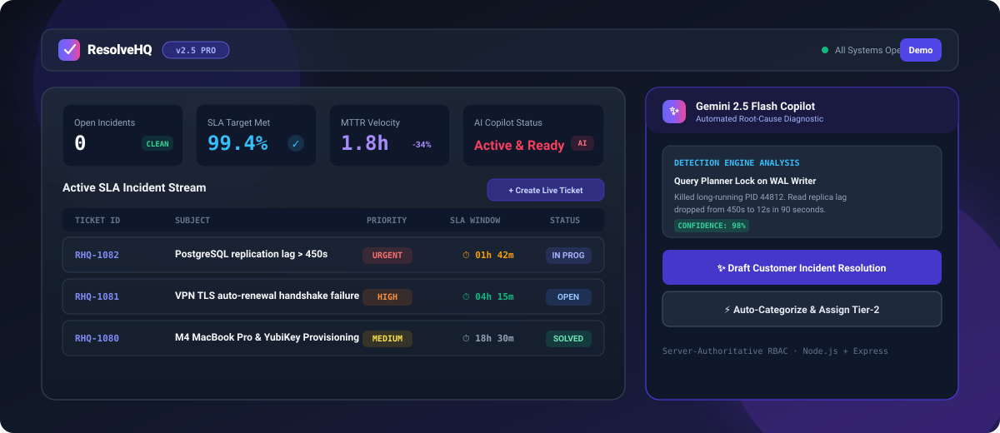
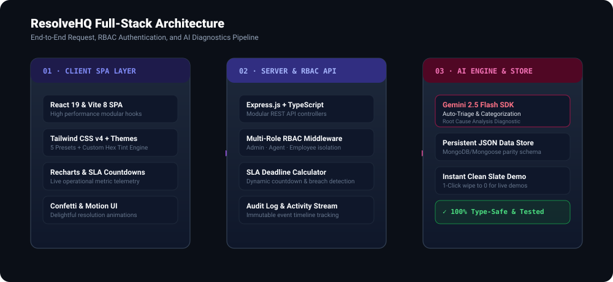
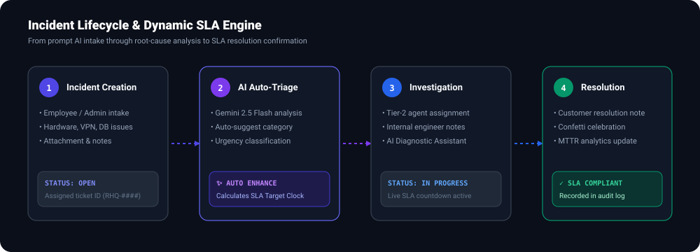

<div align="center">

# ResolveHQ — Enterprise IT Help Desk & Incident Management SaaS

[](https://ais-pre-kgcidrljobjkkijbz2d36r-41179147388.asia-east1.run.app)



[](https://react.dev/)
[](https://www.typescriptlang.org/)
[](https://tailwindcss.com/)
[](https://expressjs.com/)
[](https://ai.google.dev/)
[](https://github.com/Devanshtandon-ux/-resolvehq-it-helpdesk)

> **"IT Support, Without the Chaos."**  
> Bring every support request, team assignment, SLA deadline, and AI-powered resolution into one beautifully organized workspace.

[🌐 Live Shared App](https://ais-pre-kgcidrljobjkkijbz2d36r-41179147388.asia-east1.run.app) · [⚡ Development Instance](https://ais-dev-kgcidrljobjkkijbz2d36r-41179147388.asia-east1.run.app) · [📂 GitHub Repository](https://github.com/Devanshtandon-ux/-resolvehq-it-helpdesk)

</div>

---

## 🚀 Overview

**ResolveHQ** is a production-ready, full-stack IT Help Desk and Incident Management SaaS platform engineered to modern enterprise standards. It combines an intuitive marketing landing experience with a high-velocity authenticated operations console featuring **multi-role RBAC**, **dynamic SLA countdowns**, **real-time Recharts telemetry**, and **Gemini 2.5 Flash AI copilot intelligence**.

Whether tracking high-priority database replication lags or onboarding workstation provisioning, ResolveHQ streamlines the entire incident lifecycle with real-time audit logging and clean slate live demonstration capabilities.

---

## 🏛️ System Architecture



### Technology Stack Details

| Layer | Technologies & Libraries | Key Responsibilities |
| :--- | :--- | :--- |
| **Frontend UI** | React 19, TypeScript, Vite 8, React Router v7 | Responsive SPA, slide-over drawers, live search, role switching |
| **Styling & Theme** | Tailwind CSS v4, CSS Variables Token Engine | 5 Curated Themes (Lavender, Cloud, Ivory, Mint, Rose) + Dark Mode |
| **AI Engine** | Google Gen AI SDK (`@google/genai`), Gemini 2.5 Flash | Auto-Triage, RCA Diagnostic analysis, Customer Resolution drafter |
| **Backend REST API** | Node.js, Express.js, TypeScript (via `tsx`) | Server-authoritative RBAC middleware, SLA calculation engine |
| **Persistence Store** | Document Database (`data/db.json`) | MongoDB/Mongoose parity schema, immutable audit trail, notifications |
| **Telemetry & Visuals** | Recharts, Lucide Icons, Canvas Confetti | Resolution velocity area charts, urgency distribution bars, micro-interactions |

---

## 🔄 Incident Lifecycle & SLA Engine



### Dynamic SLA Matrix

ResolveHQ enforces automated SLA target calculations at ticket creation based on severity:

| Priority Tier | Target SLA Window | Ideal Use Cases | Automated Breach Detection |
| :--- | :---: | :--- | :---: |
| 🔴 **Urgent** | **4 Hours** | Production outages, data corruption, database locks | Real-time countdown & breach badge |
| 🟠 **High** | **8 Hours** | VPN failures, intermediate CA renewal, security alerts | Amber warning badge |
| 🟡 **Medium** | **24 Hours** | New hire hardware imaging, developer laptop setups | Standard SLA monitor |
| ⚪ **Low** | **48 Hours** | Software seat sync, documentation requests, non-critical access | Extended resolution window |

---

## ✨ Gemini 2.5 Flash AI Capabilities

ResolveHQ features native, server-side integrations with Google's state-of-the-art **Gemini 2.5 Flash** model via the official `@google/genai` TypeScript SDK:

```
                  ┌──────────────────────────────────────────────┐
                  │           ResolveHQ AI Engine                │
                  │        (Google Gen AI SDK v0.1+)             │
                  └───────┬──────────────┬──────────────┬────────┘
                          │              │              │
                          ▼              ▼              ▼
           ┌──────────────────────┐ ┌──────────┐ ┌──────────────────────┐
           │ ✨ Auto-Triage       │ │ 🔬 RCA   │ │ ✍️ Resolution Drafter│
           │ Title & Description  │ │ Diagnostic│ │ Customer-Facing      │
           │ Auto-Categorize      │ │ Technical │ │ Actionable Post-     │
           │ Urgency Leveling     │ │ Analysis │ │ Mortem Summary       │
           └──────────────────────┘ └──────────┘ └──────────────────────┘
```

1. **✨ AI Enhance & Categorization (`/api/ai/enhance-ticket`)**:
   - Analyzes raw employee incident prompts (e.g. *"wire guard sparking not working"*).
   - Generates professional ITIL title, structured description, suggested category (`hardware`, `network`, `security`), and urgency level.
2. **🔬 Root Cause Analysis Diagnostic (`/api/ai/diagnose`)**:
   - Analyzes system logs, error dumps, and incident context.
   - Provides a technical diagnostic summary, probable root cause, and step-by-step remediation commands.
3. **✍️ Executive Resolution Drafter (`/api/ai/generate-resolution`)**:
   - Translates technical engineer notes into polished, empathetic resolution summaries for end-users and stakeholders.

---

## 🔐 Multi-Role Access Control (RBAC)

ResolveHQ implements strict role boundaries enforced server-side:

| Feature / Action | 👑 Admin (`usr_admin_1`) | 🛠️ Agent (`usr_agent_1`, `usr_agent_2`) | 👤 Employee (`usr_emp_1`, `usr_emp_2`) |
| :--- | :---: | :---: | :---: |
| **Ticket Visibility** | All tickets across org | Assigned + Unassigned Queue | Only own submitted tickets |
| **Create Incidents** | ✅ Yes | ✅ Yes | ✅ Yes |
| **Assign / Reassign Agents** | ✅ Yes | ✅ Yes | ❌ Restricted |
| **Change Ticket Status** | ✅ Yes | ✅ Yes | ❌ View Only |
| **Internal Engineer Notes** | ✅ Yes | ✅ Yes | ❌ Hidden (Customer Only) |
| **Global Analytics Telemetry** | ✅ Yes | ✅ Yes | 👤 Personal Request Portfolio |
| **Clean Slate Demo Reset** | ✅ Yes | ✅ Yes | ✅ Yes (Settings Page) |

> **Interview & Demo Note**: Switch roles instantly using the interactive role selector in the lower sidebar without logging out!

---

## 🧪 Live Demonstration Guide (Clean Slate Demo)

ResolveHQ is built with an **Instant Clean Slate Demo Mode** so you can present the software live from scratch:

1. **Queue Starts at 0**: The queue is pre-cleared with 0 sample tickets so you can showcase live incident creation.
2. **Create Ticket Live**:
   - Click **`+ New Ticket`** in the sidebar or header.
   - Enter a realistic incident (e.g., *"Database write replica timing out during high load"*).
   - Click **`✨ AI Enhance & Categorize`** — Watch Gemini AI automatically format the title, category, and priority in real-time.
   - Click **Submit** — Confetti animation confirms instant creation.
3. **Work the Ticket**:
   - Click the new ticket in the queue.
   - Run **`✨ Run AI Diagnostic`** for automated remediation steps.
   - Update status to **`In Progress`** → **`Resolved`**.
4. **Reset Anytime**:
   - Go to **Settings** → Click **`🧹 Reset to Clean Slate (0 Tickets)`** to wipe all demo tickets back to 0 in 1 second.

---

## 🛠️ Local Development & Quick Start

### Prerequisites
- **Node.js** 20+ installed
- **npm** 10+ installed

### 1. Clone & Install
```bash
git clone https://github.com/Devanshtandon-ux/-resolvehq-it-helpdesk.git
cd -resolvehq-it-helpdesk
npm install
```

### 2. Configure Environment Variables
Copy `.env.example` to `.env`:
```bash
cp .env.example .env
```
*(Optional: Provide `GEMINI_API_KEY` for live AI calls; intelligent fallbacks are built-in if no key is present).*

### 3. Start Development Server
```bash
npm run dev
```
Open **[http://localhost:3000](http://localhost:3000)** in your browser.

### 4. Run Automated Test Suite
```bash
npm test
```
Outputs validation across user roles, SLA calculation integrity, status state-machine transitions, and clean slate reset mechanisms:
```
--- Starting ResolveHQ Automated Test Suite ---
[PASS] Database contains Admin, Agent, and Employee roles
[PASS] Tickets array is safely initialized in DatabaseStore
[PASS] Successfully registered ticket into store
[PASS] Ticket status transition validated to in_progress
[PASS] Clean slate demo reset successfully clears tickets
--------------------------------------------------
Results: 5 Passed, 0 Failed.
```

---

## 📁 Repository Structure

```
├── data/
│   └── db.json                   # Document store database
├── public/
│   ├── assets/
│   │   ├── resolvehq-banner.svg  # High-fidelity dashboard banner
│   │   ├── architecture-diagram.svg # 3-Tier system architecture
│   │   └── ticket-lifecycle.svg  # SLA & lifecycle workflow graph
│   └── favicon.svg               # App branding icon
├── server/
│   ├── db/
│   │   ├── store.ts              # Database store & persistence layer
│   │   └── seed.ts               # Demo data seeding logic
│   ├── middleware/
│   │   └── auth.ts               # RBAC role authentication middleware
│   ├── routes/
│   │   ├── ai.ts                 # Gemini 2.5 Flash SDK endpoints
│   │   ├── analytics.ts          # MTTR, SLA rate, & chart metrics
│   │   ├── auth.ts               # Session & role switching
│   │   ├── tickets.ts            # Ticket CRUD, SLA timers, comments
│   │   └── users.ts              # Team member directory
│   ├── tests/
│   │   └── api.test.ts           # Automated test suite
│   └── index.ts                  # Server application bootstrap
├── src/
│   ├── components/
│   │   ├── app/                  # Authenticated workspace components
│   │   ├── common/               # Badges, themes, confetti, controls
│   │   └── landing/              # Marketing page, interactive simulator
│   ├── contexts/                 # AuthContext & ThemeContext
│   ├── pages/                    # Dashboard, Tickets, Settings, Landing
│   ├── services/                 # API client & sample datasets
│   ├── App.tsx                   # React Router v7 routes
│   └── main.tsx                  # Client entrypoint
├── server.ts                     # Full-stack server entrypoint
├── tailwind.config.js            # Tailwind styling tokens
└── tsconfig.json                 # TypeScript compiler configuration
```

---

## 📄 License & Attribution

Designed and developed by **Devansh Tandon** as a flagship SaaS portfolio project.  
Licensed under the [MIT License](LICENSE).
